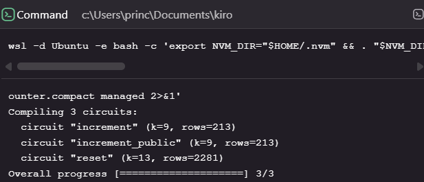
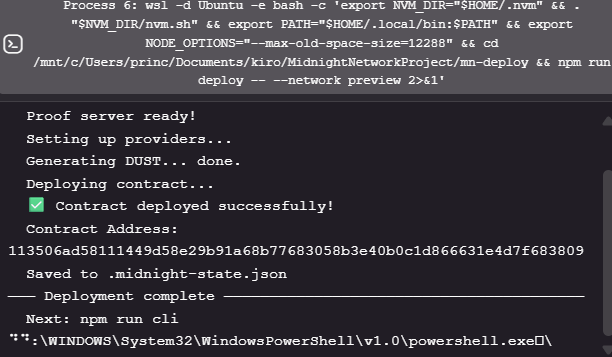

# Midnight Privacy-Preserving Counter

> A smart contract that maintains a counter with privacy — increment amounts are kept private using zero-knowledge proofs, and only the counter result is ever published on-chain.

## Contract Address

| Network  | Address                                                          |
|----------|------------------------------------------------------------------|
| Preview  | 113506ad58111449d58e29b91a68b77683058b3e40b0c1d866631e4d7f683809 |
| Preprod  | [PASTE ADDRESS AFTER DEPLOY]                                     |

## What This Does

The counter contract stores a running total on the Midnight public ledger. Anyone can see the current value of the counter, but callers can choose to keep their exact increment amount private. The contract also supports a privileged reset operation that can only be called by the original deployer, proven via a zero-knowledge ownership check — without ever revealing the owner's secret key.

Three circuits are available:

- **`increment`** — Adds a private amount (1–100) to the counter. Only the new total is published; the amount stays hidden.
- **`increment_public`** — Same as above, but the caller opts in to also disclosing the increment amount.
- **`reset`** — Resets the counter to zero. Proves ownership via secret hash without exposing the raw secret.

## Privacy Model

- **PUBLIC** (on-chain, visible to anyone):
  - `round` — total number of increment operations performed (Counter)
  - `count` — current counter value (Uint<64>)
  - `owner` — `persistentHash` of the owner's secret (Bytes<32>)
  - The *result* of each increment (disclosed via `disclose(count)`)

- **PRIVATE** (private witness, never on-chain):
  - `increment_amount()` — the exact amount added in each increment call
  - `caller_secret()` — the owner's raw 32-byte secret key

- **What the user PROVES without revealing:**
  - That their increment amount is in the range [1, 100] — enforced as a ZK circuit constraint, not a public check
  - That `persistentHash(caller_secret) == owner` — proving ownership without disclosing the secret
  - On reset: that the caller is the legitimate owner of this contract deployment

## Tech Stack

- [Midnight Network](https://midnight.network/) — privacy-preserving blockchain
- [Compact](https://docs.midnight.network/compact) — smart contract language (v0.23)
- Node.js v22
- Docker (for the proof server)
- TypeScript + Jest (tests)

## Prerequisites

- Node.js v22+ — `node --version`
- Docker running — `docker ps`
- `compactc` v0.31.1 — [download from GitHub](https://github.com/LFDT-Minokawa/compact/releases/tag/compactc-v0.31.1)
  - On Windows: use WSL (Ubuntu) with the `x86_64-unknown-linux-musl` binary
  - Add to PATH: `export PATH="$HOME/.local/bin:$PATH"`

## Setup

```bash
# Clone the repo
git clone https://github.com/PrinceDale99/MidnightNetworkProject.git
cd MidnightNetworkProject

# Install dependencies
npm install

# Compile the contract (requires compactc in PATH)
compactc contracts/counter.compact managed
# First run downloads ZK parameters (~500MB one-time)
```

## Run Tests

```bash
npx jest --testPathPattern=tests/ --forceExit
```

Expected output: **10 tests passing** across 3 suites:
- Circuit Logic (3 tests)
- State Transitions (4 tests)
- Privacy Guarantees (3 tests)

## Compile Contract

```bash
compactc contracts/counter.compact managed
```

Expected output:
```
Compiling 3 circuits:
  circuit "increment" (k=9, rows=213)
  circuit "increment_public" (k=9, rows=213)
  circuit "reset" (k=13, rows=2281)
Overall progress [====================] 3/3
```

## Run Proof Server

```bash
docker run -p 6300:6300 midnightnetwork/proof-server
```

## Deploy to Preview Network

```bash
# Install create-mn-app and scaffold a deployment environment
npx -y create-mn-app mn-deploy --template hello-world --use-npm
cd mn-deploy

# Deploy to preview (requires funded wallet)
NODE_OPTIONS="--max-old-space-size=12288" npm run deploy -- --network preview
```

Fund your wallet at the [Preview Faucet](https://faucet.testnet-v2.midnight.network/) when prompted.

## Initial Idea

**ZK-Whistleblower** — A decentralized anti-corruption and corporate auditing platform that enables employees to securely report internal fraud or environmental (ESG) violations and claim financial bounties completely anonymously.

By utilizing Midnight's Zero-Knowledge capabilities, a worker can use a privately issued cryptographic credential to prove they are a verified employee of the organization — without revealing their name, department, or wallet address. The platform evaluates submitted evidence via encrypted state, and if the violation is verified, it automatically routes a financial bounty to the whistleblower's fresh wallet — ensuring corporations cannot trace the payout.

This protects whistleblowers from retaliation while incentivizing systemic transparency at scale.

## Screenshots

**Successful compile output (circuits listed)**



**Contract deployed with address**



---

Built for **Midnight Builder Challenge — Level 1** on [Rise In](https://www.risein.com/).
